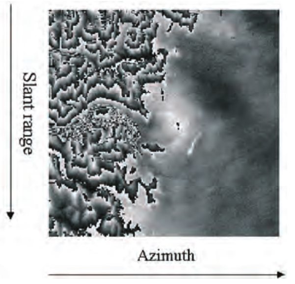
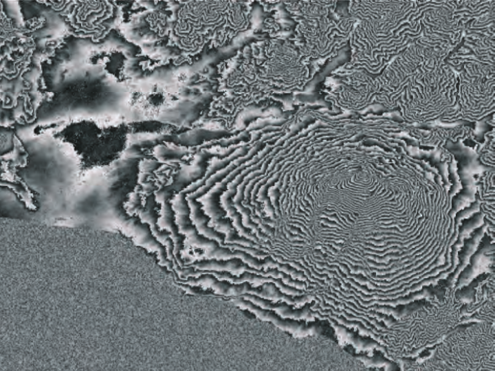
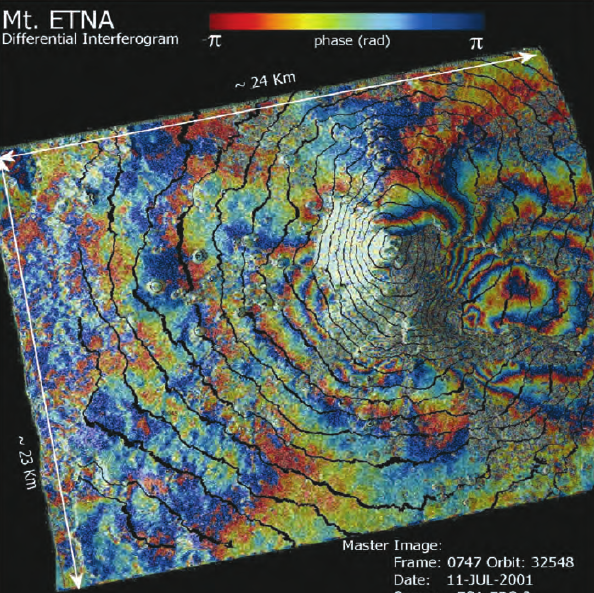

```{r setup, include=FALSE}
library(knitr)
opts_chunk$set(echo = FALSE)

library(dplyr)
library(ggplot2)
```

## Presentation Outline

1. Context: SWOT height measurement
2. Problem: uncertainty quantification
3. Approaches
4. Empirical results

## **Context**: Height Measurement

## inSAR trigonometry

```{r}
include_graphics("fig/insar-triang.png", dpi = 150)
```

## 2-D (range and azimuth) interferogram

```{r}
include_graphics("fig/alps-ifgram-raw.png", dpi = 200)
```

## Flattened interfergoram

```{r}

```


## Flattened (differential) interferogram

```{r}

```


## Flattened (differential) interferogram

Relies on a priori info (DEM)

```{r}

```

## **Problem**: Uncertain measurements

```{r}
include_graphics("fig/insar-triang.png", dpi = 150)
```

## Height error budget

- 10 cm (1-$\sigma$) requirement for an area of 1 $km^2$
- 8.9 cm from KaRIn errors (79% of allowed variance)
    - 4.4 cm random (24% of KaRIn error variance) 
    - Most of the rest is cross-track systematic error (7.4 cm = 69% variance) 
- Most of the rest is Wet Troposphere (4.0 cm = 16% of variance)

## Quantifying Uncertainty

- Goal is to describe mathematically (model) amount of uncertainty
    - Then validate this model with data
- 2 related concepts: **Uncertainty**, ***Error***
    - **Theoretical**
        - ***Empirical***
    - **Modeled**
        - ***Measured***
    - **Probability**
        - ***Statistics***
    - **Math** 
        - ***(Different) Math***

## Quantifying **Uncertainty**

Most rigorous: Probability distribution (PDF)

- real-valued ($\ge 0$) function, domain is all possible values of uncertain quantity
- e.g. $f(x; \mu, \sigma) = \frac{1}{{\sigma \sqrt {2\pi } }}\exp \Big(\frac{(x - \mu)^2}{2\sigma^2}\Big)$

```{r}
include_graphics("fig/normal-dist.png", dpi = 230)
```

## Quantifying **Uncertainty**

Less rigorous: 

- *Moments* of PDF (mean, variance, etc.)
- *Confidence interval* e.g. 95% confident that $X$ is in $[min, max]$

## Quantifying ***Error***

Error = predicted - measured (or vice versa--**residual error**)

## Quantifying ***Error***

Error = predicted - measured (or vice versa--**residual error**)

- **Probability distribution (PDF)** --> ***Histogram***

```{r}
include_graphics("fig/histogram-pdf.gif")
```

## Quantifying ***Error***

Error = predicted - measured (or vice versa--**residual error**)

- **Probability distribution (PDF)** --> ***Histogram***
    - Hypothesis test for similarity of distributions
- **PDF Moments (mean, variance)** --> ***Error Statistics (sample mean, sample variance)***
- **Confidence interval** --> ***Coverage rate***
    - e.g. *Are ~95% of errors in 95% confidence interval?*
    
    
## Correlated Errors

Consider multiple predictions and measurements in space and/or time.

- $i^{th}$ error defined as $i^{th}$ prediction - $i^{th}$ measurement:
    - $e_i = \hat{x}_i - x_i$
- If errors ar not *independent*, then 
    - $\var{e_i + e_{i+1}}

## Components of ***Error***: Bias and variance

```{r}
set.seed(14298)
data.frame(e = rnorm(100)) %>% 
  mutate(e = (as.vector(scale(e)) + 1) / 2) %>% 
  ggplot(aes(x = e)) + 
  geom_histogram(aes(y = ..density..), binwidth = 0.5, color = "gray80") +
  xlab("e = pred - meas") +
  geom_rug() +
  theme_bw()
```


## Effects of correlation

Strongly correlated errors appear biased when zoomed in

- "low-frequency"/"long-wavelength"/"low wavenumber"
- Small viewing window (e.g. minute- or pixel-scale)


## Back to SWOT error budget

