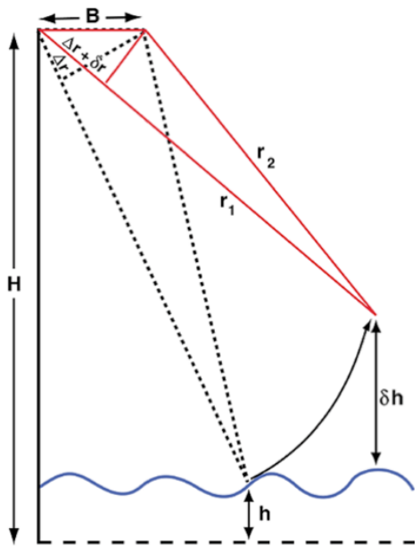
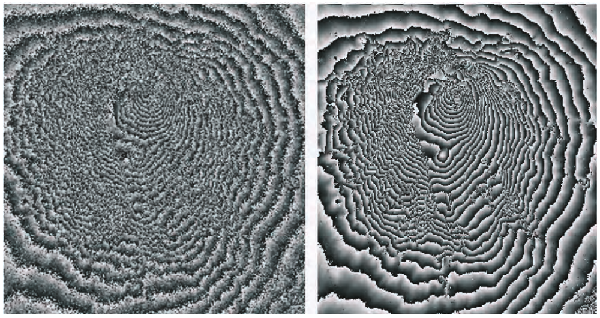

```{r setup, include=FALSE}
library(knitr)
opts_chunk$set(echo = FALSE)

library(dplyr)
library(ggplot2)
```

## Presentation Outline

1. Context: SWOT height measurement
2. Problem: uncertainty quantification
3. Approaches

## **Context**: SWOT Height ~~Measurement~~ Estimation

Clarify some terminology:

- SWOT *measures* phase, range, etc.
- it *estimates* heights, lat/lon, etc.
- Height *measurements* are ground-truth, in-situ or similar.
- *True / Actual* height is a metaphysical construct. Or it's a GDEM (for the purposes of validation).

## inSAR trigonometry

```{r}
include_graphics("fig/insar-triang.png", dpi = 130)
```

## 2-D (range and azimuth) interferogram

```{r}
include_graphics("fig/alps-ifgram-raw.png", dpi = 100)
```

## Flattened interfergoram

```{r}
include_graphics("fig/alps-ifgram-flat.png", dpi = 100)
```


## Flattened interferogram

```{r}
include_graphics("fig/etna-flat-ifgram.png", dpi = 100)
```


## Flattened (differential) interferogram

Relies on a priori info (DEM)

```{r}
include_graphics("fig/etna-diff-ifgram.png", dpi = 100)
```

## **Problem**: Uncertain measurements

```{r}
include_graphics("fig/insar-triang.png", dpi = 150)
```

## Height error budget

- 10 cm (1-$\sigma$) requirement for an area of 1 $km^2$
- 8.9 cm from KaRIn errors (79% of allowed variance)
    - 4.4 cm random (24% of KaRIn error variance) 
    - Most of the rest is cross-track systematic error (7.4 cm = 69% variance) 
- Most of the rest is Wet Troposphere (4.0 cm = 16% of variance)

## Quantifying Uncertainty

- Goal is to describe mathematically (model) amount of uncertainty
    - Then validate this model with data
- 2 related concepts: **Uncertainty**, ***(Measured) Error***
    - **Theoretical**
        - ***Empirical***
    - **Modeled**
        - ***Measured***
    - **Probability**
        - ***Statistics***
    - **Math** 
        - ***(Different) Math***

## Quantifying **Uncertainty**

Most rigorous: Probability distribution (PDF)

- real-valued ($\ge 0$) function, domain is all possible values of uncertain quantity
- e.g. $f(x; \mu, \sigma) = \frac{1}{{\sigma \sqrt {2\pi } }}\exp \Big(\frac{(x - \mu)^2}{2\sigma^2}\Big)$

```{r}
include_graphics("fig/normal-dist.png", dpi = 230)
```

## Quantifying **Uncertainty**

Less rigorous: 

- *Moments* of PDF (mean, variance, etc.)
- *Confidence interval* e.g. 95% confident that $X$ is in $[min, max]$

## Quantifying ***Error***

Error = estimated value - true value

$$
e = \hat{x} - x
$$

## Quantifying ***Error***

$e = \hat{x} - x$

- **Probability distribution (PDF)** --> ***Histogram***

```{r}
include_graphics("fig/histogram-pdf.gif")
```

- **Uncertainty model** (normal PDF) for ***errors***, histogram matches. 


## Quantifying ***Error***

$e = \hat{x} - x$

- **Probability distribution (PDF)** --> ***Histogram***

```{r}
include_graphics("fig/histogram-pdf.gif")
```


## Quantifying ***Error***

$e = \hat{x} - x$

- **Probability distribution (PDF)** --> ***Histogram***
    - Hypothesis test for similarity of distributions
- **PDF Moments (mean, variance)** --> ***Error Statistics (sample mean, sample variance)***
- **Confidence interval** --> ***Coverage rate***
    - e.g. *Are ~95% of errors in 95% confidence interval?*
    
## Components of ***Error***: Bias and variance

Consider the errors in this histogram:

```{r, fig.width = 4, fig.height = 3, fig.align="right"}
set.seed(142981)

histdf <- data.frame(e = rnorm(100)) %>% 
    mutate(e = (as.vector(scale(e)) + 1) / 2)

# sd(histdf$e)

histdf %>% 
  ggplot(aes(x = e)) + 
  geom_histogram(aes(y = ..density..), binwidth = 0.5, color = "gray80") +
  xlab("e = est. - truth") +
  geom_rug() +
  geom_vline(xintercept = c(0, 0.5), color = c("black", "red")) +
  theme_bw()
```

- Mean error is 0.5 -> ***Bias***
- Standard deviation (SD) of error is 0.5
    - Variance: $Var = SD^2$
- $RMSE = \sqrt{Bias^2 + Var} = 0.71 \mathbf{> 0.5}$

## Components of ***Error***: Bias and variance

Consider the errors in this histogram:

```{r, fig.width = 4, fig.height = 3, fig.align="right", fig}
set.seed(142981)

histdf <- data.frame(e = rnorm(100)) %>% 
    mutate(e = (as.vector(scale(e)) + 1) / 2)

# sd(histdf$e)

histdf %>% 
  ggplot(aes(x = e)) + 
  geom_histogram(aes(y = ..density..), binwidth = 0.5, color = "gray80") +
  xlab("e = est - truth") +
  geom_rug() +
  geom_vline(xintercept = c(0, 0.5), color = c("black", "red")) +
  theme_bw()
```

- What happens if we average the errors in the histogrm?

## Correlated Errors

Consider multiple predictions and measurements in space and/or time.

- $i^{th}$ error defined as $i^{th}$ estimate - $i^{th}$ true value:
    - $e_i = \hat{x}_i - x_i$
- If errors ar *independent*, then 
    - $var{e_i + e_{i+1}} = var{e_i} + var_{e_{i+1}}$
    - Mean over $n$ errors has variance $\frac{\sigma^2_e}{n}$
- If errors ar ***not*** *independent*, then 
    - $var{e_i + e_{i+1}} \ne var{e_i} + var_{e_{i+1}}$
    - $var{e_i + e_{i+1}} > var{e_i} + var_{e_{i+1}}$ if positive correlation
    - Mean over $n$ errors has variance $> \frac{\sigma^2_e}{n}$

## Correlated Errors

Consider multiple predictions and measurements in space and/or time.

```{r}
include_graphics("fig/histogram-pdf-correlated.gif")
```


## Correlated Errors

Compare:

```{r}
include_graphics("fig/histogram-pdf.gif")
```


## Effects of correlation

Strongly correlated errors appear biased when zoomed in

- "low-frequency"/"long-wavelength"/"low wavenumber"
- Small viewing window (e.g. minute- or pixel-scale)

```{r}
set.seed(310843)
tssim <- arima.sim(model = list(ar = c(0.995, -0.01)), n = 1000)
par(mfrow = c(1, 2))
plot(tssim)
hist(tssim, breaks = 8)
par(mfrow = c(1, 1))
```

## Effects of correlation

Strongly correlated errors appear biased when zoomed in

- "low-frequency"/"long-wavelength"/"low wavenumber"
- Small viewing window (e.g. minute- or pixel-scale)

```{r}
par(mfrow = c(1, 2))
plot(tssim, xlim = c(501, 600))
hist(tssim[501:600], breaks = 5)
par(mfrow = c(1, 1))
```


## Back to SWOT height error budget

- 10 cm (1-$\sigma$) requirement for an area of 1 $km^2$
- 8.9 cm from KaRIn errors (79% of allowed variance)
    - **4.4 cm random (24% of KaRIn error variance)** 
        - most of this is **phase error**
    - Most of the rest is cross-track systematic error (7.4 cm = 69% variance) 
- Most of the rest is Wet Troposphere (4.0 cm = 16% of variance)

## Phase error

- (lat, lon, height) <-> (phase, range, doppler)

```{r}

```

## Phase ($\phi$) error

$e_\phi = \hat{\phi} - \phi_{real}$

- (lat, lon, height) <---> (phase, range, doppler)
- Related to *coherence* ($\gamma$) of radar signals between antennas.
    - How much is radar pulse scattered by (water) surface, atmosphere?
- Related to *number of looks*, $N_l$ over which phase measurement is averaged
- Lower bound on *variance of $e_\phi$*: 
    - $\sigma^2_{e_\phi} = \frac{1}{2 N_l} \frac{1 - \gamma^2}{\gamma^2}$
    - **This is an approximation** 
    - Does this give a PDF?
        - NO! Just a variance / standard deviation

## Height error at pixel scale

At small scales, phase to height conversion is approximately linear:

- $\frac{\partial h}{\partial \phi} \approx d_h$
    - $d_h$ from simple trigonometry
- So $\sigma_{e_h} = d_h \sigma_{e_\phi}$

## Aggregating heights

- *Multilooking*: each pixel averages measurements (phase, etc.) from multiple *looks*

```{r}

```

## Aggregating heights

- *Multilooking*: each pixel averages measurements (phase, etc.) from multiple *looks* (pixels? Kind of.)
    - SWOT *pixels* are multilooked (even "rare" product)
- *Feature averaging*: Use all pixels within a feature to estimate (average) height

## Height error at feature scale (1st way)

*multilook-all*

- Estimate phase error variance
- Aggregate to feature scale (average phase error variance)
- Convert to height error error variance via $d_h$

$$
\sigma^2_{e_{h}} = \Bigg(\frac{\sum_x d_h^2(x)}{\sum_x d_h{x}}\Bigg)^2 \sigma^2_{\bar{e}_\phi}
$$

## Height error at feature scale (2nd way)

*Height standard deviation*

- Estimate phase 
- Convert to height
- Compute variance of height estimate over entire feature
- Scale by effective number of looks

$$
\sigma^2_{e_{h}} = \frac{Var_f(\hat{h})}{N_f} \frac{\bar{N}_m}{\bar{N}_r}
$$

## Height error at feature scale (2nd way)

*Height standard deviation*

- Empirical
- Assume height estimates are unbiased at feature scale

```{r}
histdf %>% 
  ggplot(aes(x = e)) + 
  geom_histogram(aes(y = ..density..), binwidth = 0.5, color = "gray80") +
  xlab("e = est. - truth") +
  geom_rug() +
  geom_vline(xintercept = c(0, 0.5), color = c("black", "red")) +
  theme_bw()
```


## Discuss
